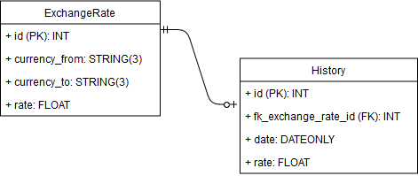

# Shopee Back-End Test
## Foreign Currency

### About
This APIs will be used by front-end engineers to develop an application that store and display foreign exchange rate for currencies on a daily basis.
### How to run app (via Docker)
1. Open the CMD/bash in the app folder, then run docker-compose up --build
2. The app will run on localhost at port 3000 (http://localhost:3000).
### Main dependencies
1. Node js version 8.*
2. Mysql version 5.7.24
### APIs Documentation
The documentation has been published with Postman ([here](https://documenter.getpostman.com/view/1787383/RzffLqmd)).
### Explanation
#### Database structure and design

The database has 2 main Entities, ExhangeRate and History. The former is used to store data foreign exchange currencies. It has id (integer), currency_from (string), currency_to(string) and rate(float) attributes. The latter is used to store the data history of certain exchange rate currencies. It has id, (integer) fk_exchange_rate_id (integer), date(date), rate (float). The relationship defined of these entity is one-end optional to many-end mandatory. It means that ExchangeRate may have one or none History record, and History must have one or more ExhangeRate record.
### App
The App built using Express js framework and mysql for database. It also using the Model View Controller (MVC) pattern App design.  The Models implemented the ORM paradigm to abstract the data as abject using sequlize.js. There are two Models defined in models folder, exchange_rate.model and history.model. Controller is the place where logic controllers exist. There is one controller defined in controller folder, users.controller. In the View sections, I created five html files. Each file display the same use cases (5 usecase) as described on the interview document test.
